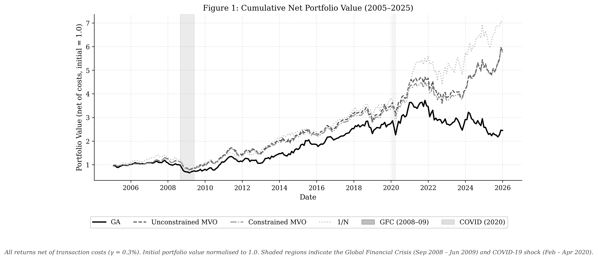
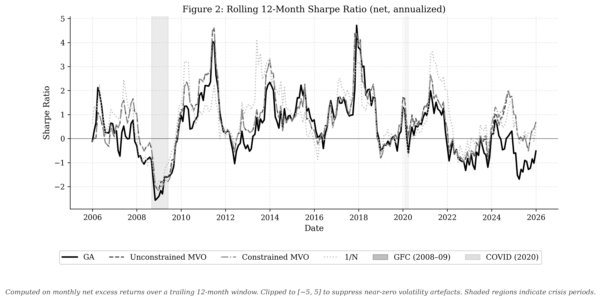
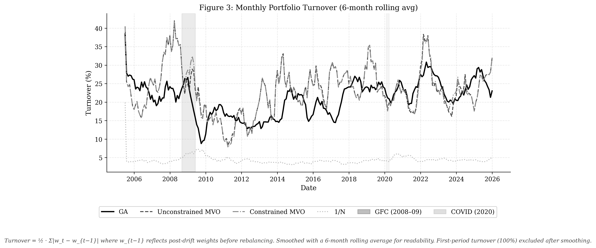
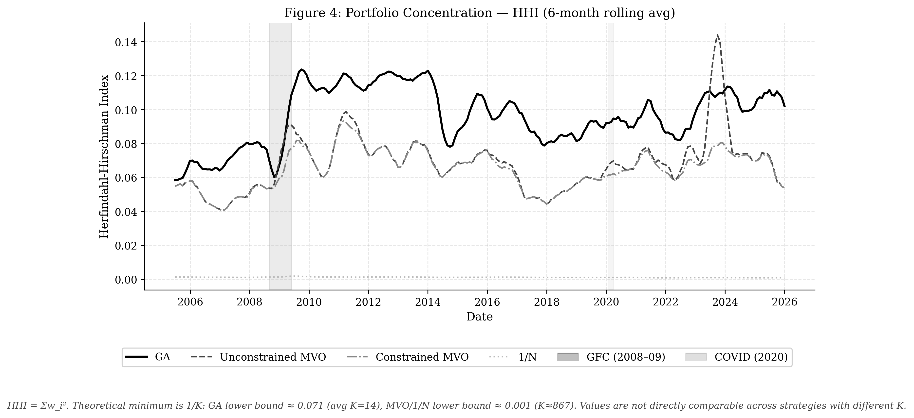
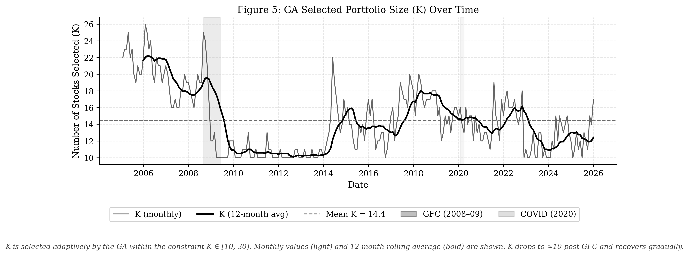
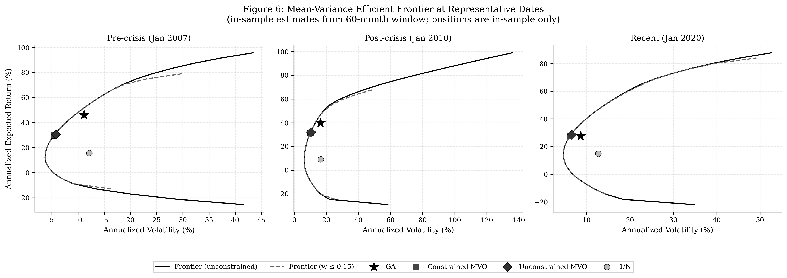
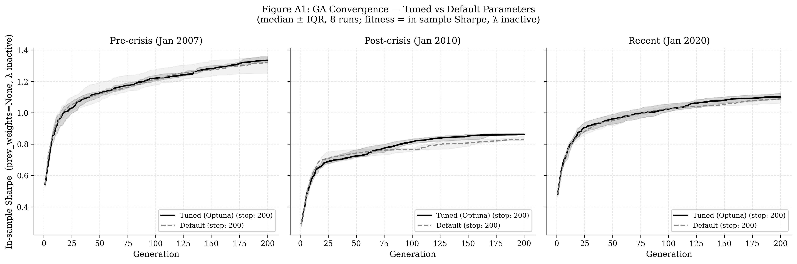

# GA Portfolio Optimization

Genetic algorithm for cardinality-constrained portfolio optimization on US equities - BSc CS thesis, VU Amsterdam.


---

## Results

| Strategy | Sharpe (net) | Return (net) | Vol | Max DD | Avg Turnover |
|---|---|---|---|---|---|
| **GA (adaptive K)** | **0.8751** | **14.78%** | 16.89% | -38.16% | 21.83% |
| Constrained MVO | 0.5557 | **7.56%** | 13.60% | -40.48% | 24.13% |
| Unconstrained MVO | 0.5592 | **7.60%** | 13.60% | -38.68% | 24.14% |
| 1/N (~867 stocks) | 0.5237 | **9.10%** | 17.38% | -52.19% | 5.85% |

GA statistically outperforms all three benchmarks (Jobson-Korkie test, α = 0.05). Evaluation period: January 2005 - December 2025, 252 monthly rebalancing periods, transaction cost γ = 0.3%.

---

## Overview

Mean-variance optimization breaks down when the estimation window is short relative to the number of assets - with T=60 months and N≈867 stocks, the sample covariance matrix is nearly singular. The central question here is whether an evolutionary algorithm that directly constrains portfolio size, weight concentration, and turnover can produce better out-of-sample results than MVO and naive diversification.

The GA selects K ∈ [10, 30] stocks each period and optimises a Sharpe-minus-turnover fitness function with Optuna-tuned parameters, evaluated over 20 years of rolling monthly returns. On the same universe and cost model as the benchmarks, it achieves a net Sharpe of 0.8751 - 0.28 points above the next-best benchmark, significant at α = 0.05.

---

## Results — Figures


*Cumulative net portfolio value (2005–2025). GA reaches ~24× vs ~6× for benchmarks.*


*Rolling 12-month Sharpe ratio. GA consistently leads across market regimes including GFC and COVID.*

<details>
<summary>More figures</summary>


*Monthly portfolio turnover (6-month rolling avg). GA turnover (21.8%) is below Constrained MVO (24.1%) despite holding a much smaller portfolio.*


*HHI concentration over time. GA is more concentrated by construction (avg K=14 vs 867 for benchmarks) — HHI values are not directly comparable across strategies.*


*Adaptive cardinality K over time. GA collapses to K≈10 post-GFC, reflecting higher estimation uncertainty.*


*Mean-variance frontier at 3 representative dates (in-sample μ/Σ). GA operates inside the unconstrained frontier by design.*


*GA convergence: Optuna-tuned vs default parameters. Tuned operators reach higher in-sample Sharpe in fewer generations (Appendix A1).*

</details>

---

## Repository Structure

```
ga-portfolio-optimization/
├── data/
│   ├── raw/                  # CRSP CSV + FRED risk-free rate (not tracked)
│   └── processed/            # Parquet files produced by pipeline (not tracked)
├── src/
│   ├── data/
│   │   ├── loader.py         # CRSP CSV → parquet
│   │   ├── universe.py       # Eligible universe construction per rebalancing date
│   │   ├── returns.py        # Excess return computation (ret - rf)
│   │   └── risk_free_rate.py # FRED DTB3 processing
│   ├── benchmarks/
│   │   ├── mvo.py            # Unconstrained and constrained MVO (SLSQP)
│   │   └── equal_weight.py   # 1/N naive benchmark
│   ├── optimization/
│   │   ├── genetic_algorithm.py  # GA operators, fitness function, main loop
│   │   ├── runner.py             # Rolling OOS experiment with checkpointing
│   │   └── optuna_tuner.py       # Hyperparameter search (TPE, 15 trials)
│   ├── evaluation/
│   │   ├── metrics.py        # Sharpe, Sortino, drawdown, turnover, HHI
│   │   ├── figures.py        # F1–F5 publication figures
│   │   ├── significance.py   # Paired t-test + Jobson-Korkie significance tests
│   │   ├── tables.py         # Table 1 (performance) and Table 3 (characteristics)
│   │   ├── convergence.py    # Appendix A1 convergence plot
│   │   └── frontier.py       # Figure 6 efficient frontier
│   └── utils/
│       ├── portfolio.py      # Shared portfolio utilities (drift, alignment, estimation window)
│       └── data.py           # Data loading entry point
├── tests/
│   └── test_metrics.py       # 38 unit tests for evaluation metrics
├── results/
│   ├── figures/              # PNG outputs (not tracked)
│   ├── tables/               # CSV + LaTeX outputs (not tracked)
│   └── ga/                   # GA parquet results + checkpoints (not tracked)
└── requirements.txt
```

---

## Methodology

**Data**
- CRSP monthly stock file (CIZ format), Jan 2000 – Dec 2025, sourced from WRDS
- NYSE and NASDAQ common stocks, market cap ≥ $2B (lagged 1 month)
- ~867 eligible stocks per month (range: 487–1,105)
- Risk-free rate: FRED DTB3 (3-month T-bill, annual % → monthly decimal)

**Universe construction**
- 60-month burn-in → first rebalancing date: January 2005
- Stock eligible iff: exactly 60 non-missing returns in the estimation window and market cap ≥ $2B at t-1
- Covariance regularized as Σ + 1e-4·I (T=60 << N≈867 makes sample Σ near-singular)

**Genetic Algorithm**
- Chromosome: real-valued weight vector with K ∈ [10, 30] non-zero entries, w_i ∈ [0.02, 0.15], Σw = 1
- Fitness: monthly Sharpe - λ·Turnover (λ = 1.8437 from Optuna)
- Operators: tournament selection (k=3), blend crossover (pc=0.6054), Gaussian weight mutation + asset-swap (pm=0.137, σ_m=0.1469)
- Population: 100 | Generations: 200 | Early stop: 20 stagnant generations
- Local refinement: greedy pairwise weight-shift hill-climber on best elite each generation
- 30 independent runs per period; canonical portfolio selected at median in-sample fitness

**MVO benchmarks**
- Unconstrained: maximize Sharpe, long-only bounds [0, 1], SLSQP
- Constrained: maximize Sharpe, long-only, max weight 0.15, SLSQP
- Same estimation window, universe, and cost model as GA

**Evaluation protocol**
- 252 monthly OOS periods, January 2005 – December 2025
- Transaction cost: γ = 0.3% per unit turnover (applied to all strategies)
- Turnover computed against post-drift pre-rebalance weights
- Checkpointing after every period; cloud runs on Google Cloud c2-standard-8

**Statistical tests**
- Paired t-test: H₀: mean return difference = 0
- Jobson-Korkie test (Memmel 2003 correction): H₀: Sharpe difference = 0
- α = 0.05, two-tailed

---

## Installation

```bash
git clone https://github.com/georgeded/ga-portfolio-optimization.git
cd ga-portfolio-optimization
pip install -r requirements.txt
```

> **Data access:** Raw CRSP data requires a WRDS subscription. Download the monthly stock file (CIZ format, 2000–2025) and the FRED DTB3 series, then place them in `data/raw/` as `crsp_returns.csv` and `risk_free_rate.csv`.

---

## Reproduction

Run each step in order. All commands are run from the repository root.

**1. Data pipeline**

```bash
# Parse and validate raw CRSP data
python3 -m src.data.loader

# Build eligible universe (487–1,105 stocks/month)
python3 -m src.data.universe

# Compute excess returns
python3 -m src.data.returns

# Process risk-free rate
python3 -m src.data.risk_free_rate
```

**2. Hyperparameter tuning** *(optional — pre-tuned values already in `genetic_algorithm.py`)*

```bash
python3 -m src.optimization.optuna_tuner
```

**3. Benchmarks**

```bash
python3 -m src.benchmarks.mvo
python3 -m src.benchmarks.equal_weight
```

**4. GA out-of-sample experiment**

```bash
# Full run (30 parallel runs × 200 generations × 252 periods — compute-intensive)
python3 -m src.optimization.runner

# Debug mode (3 runs, 50 generations, 10 periods)
python3 -m src.optimization.runner --debug

# Resume from checkpoint
python3 -m src.optimization.runner
```

**5. Evaluation**

```bash
# Figures F1–F5
python3 -m src.evaluation.figures

# Efficient frontier (Figure 6)
python3 -m src.evaluation.frontier

# Convergence plot (Appendix A1)
python3 -m src.evaluation.convergence

# Performance and characteristics tables
python3 -m src.evaluation.tables

# Statistical significance tests (Table 2)
python3 -m src.evaluation.significance
```

---

## License

MIT © [Georgios Dedempilis](https://github.com/georgeded)
