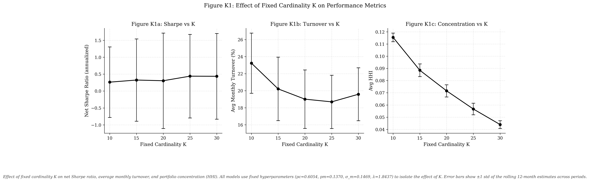
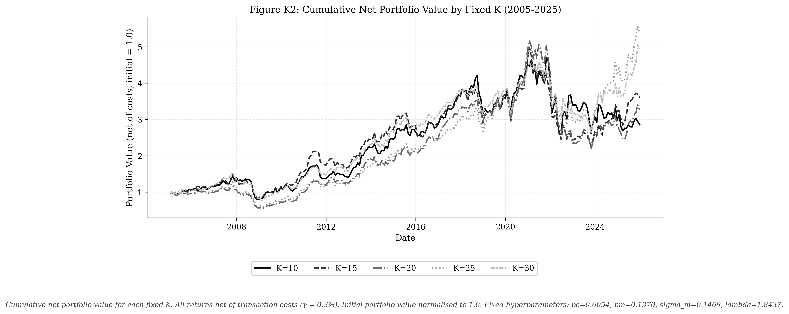
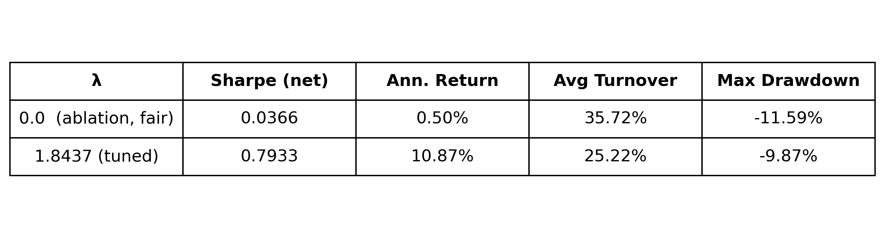
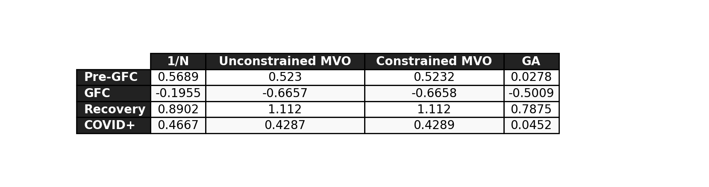
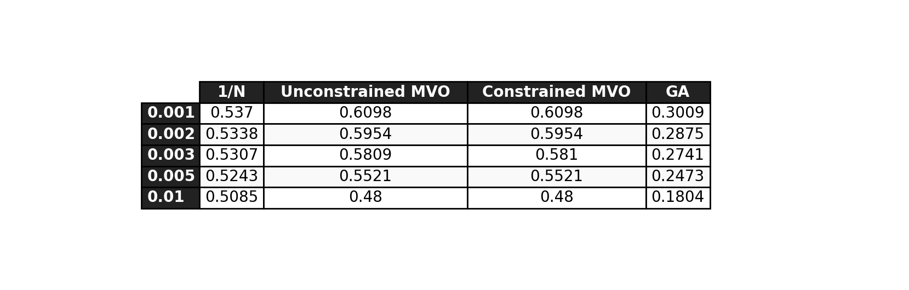

# GA Portfolio Optimization

BSc CS thesis project at VU Amsterdam. A genetic algorithm for cardinality-constrained portfolio optimization on US equities, evaluated out-of-sample from January 2005 to December 2025 and compared against mean-variance optimization (MVO) and equal-weight (1/N) benchmarks. The GA selects between 10 and 30 stocks per month, optimizes a Sharpe-minus-turnover fitness function with hyperparameters fixed from an initial Optuna tuning run, and is tested across 252 monthly out-of-sample periods using a rolling 60-month estimation window and a transaction cost of gamma = 0.3% per unit of turnover. Covariance is estimated with the Ledoit-Wolf shrinkage estimator. The core question is whether an evolutionary algorithm that directly constrains portfolio size, weight concentration, and turnover can produce better out-of-sample risk-adjusted returns than MVO on a large universe where the sample covariance matrix is rank-deficient (T = 60, N around 870).

## Results

| Strategy | Sharpe (net) | Ann. Return | Ann. Vol | Max Drawdown | Avg Turnover |
|---|---|---|---|---|---|
| **GA (adaptive K)** | **0.2741** | **5.5%** | **19.9%** | **-55.8%** | **22.2%** |
| Constrained MVO | 0.5810 | 8.3% | 14.3% | -43.1% | 17.1% |
| Unconstrained MVO | 0.5809 | 8.3% | 14.3% | -43.1% | 17.1% |
| 1/N (~867 stocks) | 0.5307 | 9.1% | 17.2% | -51.3% | 4.5% |

Evaluation: January 2005 to December 2025, 252 monthly out-of-sample periods. All metrics are on net excess returns after transaction costs. Annualized return = mean monthly * 12, annualized vol = monthly std * sqrt(12), Sharpe = annualized return / annualized vol. Constrained MVO caps individual weights at 0.15.

The GA underperforms all three benchmarks. The Jobson-Korkie test shows the GA vs MVO Sharpe gap is statistically significant (p = 0.004). The GA vs 1/N gap is not significant (p = 0.132).

Constrained and unconstrained MVO produce nearly identical results (Sharpe 0.5810 vs 0.5809). The 0.15 weight cap rarely binds at N around 870, consistent with Jagannathan and Ma (2003).

The underperformance is more likely driven by in-sample fitness noise: with N/T around 14.5, the Sharpe estimated from the rank-deficient covariance matrix is a poor proxy for out-of-sample returns.

## K-Sensitivity

Fixed cardinality experiments show how portfolio size K affects performance. Each K value uses the same hyperparameters (pc=0.6054, pm=0.1370, sigma_m=0.1469, lambda=1.8437) with K fixed rather than adaptive.

| K | Sharpe (net) | Ann. Return | Avg Turnover | Avg HHI |
|---|---|---|---|---|
| 10 | 0.263 | 5.5% | 23.2% | 0.115 |
| 15 | 0.325 | 6.3% | 20.2% | 0.088 |
| 20 | 0.305 | 5.7% | 19.0% | 0.072 |
| 25 | 0.440 | 8.0% | 18.7% | 0.057 |
| 30 | 0.436 | 7.3% | 19.6% | 0.044 |

The adaptive GA ends up using K around 16 on average, closer to the lower end of the [10, 30] range. Fixed K=25 and K=30 substantially outperform the adaptive version (Sharpe 0.44 vs 0.27). This suggests the adaptive mechanism is too conservative, gravitating toward smaller portfolios due to the turnover penalty.





## Figures


*Cumulative net portfolio value (2005 to 2025). All strategies show drawdowns during the 2008-09 GFC and the COVID-19 shock in 2020.*


*Rolling 12-month Sharpe ratio. GA underperforms MVO across most of the evaluation period.*

<details>
<summary>More figures</summary>


*Monthly portfolio turnover. GA turnover (22.2%) is slightly above MVO (17.1%) in v2.*


*HHI concentration over time. GA is more concentrated by construction (avg K around 16). Theoretical minimum: GA 1/16 = 0.063, MVO 1/62 = 0.016 (observed HHI: 0.034, approximately 62 stocks held on average), 1/N 1/867 = 0.001.*


*Adaptive cardinality K over time. The GA uses K around 16 on average.*


*Mean-variance frontier at three representative dates.*


*GA convergence: tuned vs default parameters.*

</details>




*Net Sharpe ratio by market regime.*


*Sharpe sensitivity to transaction cost assumption.*

## Lambda Ablation

Both lambda configurations run the full 252-period out-of-sample chain.

| lambda | Sharpe (net) | Ann. Return | Avg Turnover | Avg K |
|---|---|---|---|---|
| 0.0 (no penalty) | 0.4993 | 8.4% | 57.1% | 25.1 |
| 1.8437 (tuned) | 0.2741 | 5.5% | 22.2% | 16.3 |

Without the penalty, the GA trades 57% per month and selects 25 stocks on average. The higher turnover costs are offset by better stock selection, giving Sharpe 0.499. The penalty reduces turnover to 22% but also reduces portfolio size to K around 16 and Sharpe to 0.274. The penalty trades return quality for trading cost control. At gamma = 0.3% the tradeoff is not obviously worth it on Sharpe alone, but the high turnover under lambda = 0 would be costly in practice. Neither configuration beats MVO (Sharpe 0.581). The underperformance under both lambda settings suggests the cause is estimation noise from T=60, N around 870 rather than the penalty itself.

## Repository Structure

```
src/
  data/           loader.py, universe.py, returns.py, risk_free_rate.py
  benchmarks/     mvo.py, equal_weight.py
  optimization/   genetic_algorithm.py, runner.py, optuna_tuner.py,
                  k_sensitivity.py
  evaluation/     metrics.py, figures.py, significance.py, tables.py,
                  post_processing.py, convergence.py, frontier.py,
                  k_sensitivity_tables.py, k_sensitivity_figures.py
  ablation/       ablation_lambda.py
  utils/          portfolio.py, data.py
run_evaluation.sh
tests/
  test_metrics.py
  test_genetic_algorithm.py
  test_backtest_integrity.py
results/
  figures/         F1-F6, A1 convergence PNGs
  tables/          T1_performance through T8_k_behavior (CSV, LaTeX, PNG)
  k_sensitivity/   FK1, FK2, table (CSV, LaTeX, PNG)
  ablation/        lambda ablation (CSV, PNG)
  post_processing/ subperiod, TC sensitivity, K behavior (CSV, PNG)
```

## Methodology

**Data**
- CRSP monthly stock file (CIZ format), Jan 2000 to Dec 2025, sourced from WRDS
- NYSE and NASDAQ common stocks, market cap >= $2B (lagged 1 month to avoid look-ahead bias)
- Around 870 eligible stocks per month (range: 487 to 1,105)
- Risk-free rate: FRED DTB3 (3-month T-bill, annual % converted to monthly decimal)

**Universe construction**
- 60-month burn-in; first rebalancing date is January 2005
- Stock eligible if it has exactly 60 non-missing returns in the estimation window and market cap >= $2B at t-1
- Covariance estimated using the Ledoit-Wolf shrinkage estimator (sklearn.covariance.LedoitWolf)

**Genetic Algorithm**
- Chromosome: real-valued weight vector with K in [10, 30] non-zero entries, each in [0.02, 0.15], summing to 1
- Fitness: monthly Sharpe minus lambda * Turnover (lambda = 1.8437)
- Selection: tournament (k=3)
- Crossover: union-based asset sampling with arithmetic weight blend (pc = 0.6054)
- Mutation: Gaussian weight perturbation and asset swap (pm = 0.1370, sigma_m = 0.1469)
- Repair: bisection projection onto bounded simplex; enforces cardinality, weight bounds, and budget constraint
- Local refinement: greedy pairwise weight-shift hill-climber on best elite, 5 iterations per generation
- Population: 100 | Max generations: 200 | Early stop: 20 stagnant generations
- 8 independent runs per period; canonical portfolio is the one closest to median in-sample fitness

**MVO benchmarks**
- Unconstrained: maximize Sharpe, long-only bounds [0, 1], SLSQP (maxiter=200, ftol=1e-6, 3 random restarts)
- Constrained: maximize Sharpe, long-only, max weight 0.15, SLSQP (3 random restarts)
- Both use the same estimation window, universe, and cost model as the GA
- Three restarts were used to reduce sensitivity to initial conditions; a rerun confirmed the reported numbers are unchanged

**Evaluation protocol**
- 252 monthly OOS periods, January 2005 to December 2025
- Rolling 60-month estimation window (not expanding)
- Transaction cost: gamma = 0.3% per unit of turnover, deducted from all strategies
- Turnover computed against post-drift pre-rebalance weights
- Checkpointing after every period for resumable long-running experiments

**Statistical tests**
- Paired t-test: null = mean monthly net excess return difference is zero
- Jobson-Korkie test (Memmel 2003 correction): null = Sharpe ratio difference is zero
- Two-tailed, alpha = 0.05

**Hyperparameter tuning**
- Optuna TPE sampler, 15 trials, tuning period 2005 to 2012 (96 periods)
- Reduced settings: 3 runs, 30 generations per trial
- Tuned parameters (pc=0.6054, pm=0.1370, sigma_m=0.1469, lambda=1.8437) fixed for the full 2005 to 2025 evaluation
- Walk-forward per-period tuning was considered but infeasible at about 20 min/period on the available VM

## Reproduction

> **Note:** Result parquets (GA output, benchmarks, k-sensitivity runs,
> ablation) are not committed to this repository. Running steps 1 to 7
> in order generates all required files. A fresh clone cannot run
> run_evaluation.sh without completing the pipeline first.

Run each step in order from the repository root. Raw CRSP data requires a WRDS subscription. Download the monthly stock file (CIZ format, 2000 to 2025) (WRDS path: CRSP Annual Update -> Stock Version 2 (CIZ) -> Monthly Stock File. Required columns include MthCalDt, MthRet, MthRetx, MthPrc, PrimaryExch, ShareType, SecurityType, SecuritySubType, USIncFlg, IssuerType, ShrOut) and the FRED DTB3 series, then place them in `data/raw/` as `crsp_returns.csv` and `risk_free_rate.csv`.

**1. Data loading**

```bash
python3 -m src.data.loader
python3 -m src.data.risk_free_rate
```

**2. Universe construction**

```bash
python3 -m src.data.universe
python3 -m src.data.returns
```

**3. MVO benchmarks**

```bash
python3 -m src.benchmarks.mvo
```

**4. Equal-weight benchmark**

```bash
python3 -m src.benchmarks.equal_weight
```

**5. Optuna tuning** *(optional, tuned parameters are already in `genetic_algorithm.py`)*

```bash
python3 -m src.optimization.optuna_tuner
```

**6. Full GA run** (35-45 minutes on c2-standard-16, 8 physical cores)

```bash
python3 -m src.optimization.runner
```

Resume from checkpoint by running the same command again. Use `--debug` for a fast 10-period smoke test (3 runs, 50 generations):

```bash
python3 -m src.optimization.runner --debug
```

**6b. K-sensitivity** *(optional, runs each fixed K value independently)*

```bash
python3 -m src.optimization.k_sensitivity
```

Or a single K value:

```bash
python3 -m src.optimization.k_sensitivity --k 25
```

**7. Lambda ablation** (about 30 minutes for the lambda=0 GA run)

```bash
python3 -m src.ablation.ablation_lambda
```

This runs the full 252-period GA with lambda=0, then compares with the main results parquet.

> **Note:** run_evaluation.sh (Step 8) also runs the ablation as its
> first step. If you proceed directly to Step 8, you can skip Step 7.

**8. Evaluation figures and tables**

```bash
./run_evaluation.sh
```

This runs the lambda ablation followed by all evaluation scripts in order. Individual scripts can also be run directly:

```bash
python3 -m src.evaluation.tables
python3 -m src.evaluation.significance
python3 -m src.evaluation.figures
python3 -m src.evaluation.post_processing
python3 -m src.evaluation.k_sensitivity_tables
python3 -m src.evaluation.k_sensitivity_figures
python3 -m src.evaluation.convergence
python3 -m src.evaluation.frontier
```

## Setup

Python 3.11+.

```bash
python3 -m venv .venv
source .venv/bin/activate
pip install -r requirements.txt
python3 -m pytest
```

Key dependencies: `pandas`, `numpy`, `scipy`, `scikit-learn`, `pyarrow`, `statsmodels`, `optuna`, `matplotlib`, `seaborn`, `tqdm`.

## Limitations and reproducibility

Raw CRSP data is not included because it is proprietary (WRDS subscription required). `requirements.txt` lists the Python dependencies. `REPRODUCIBILITY.md` gives the exact reproduction order from raw data to final figures. The integrity tests in `tests/` use synthetic data only and can be run without WRDS access.

## License

MIT © [Georgios Dedempilis](https://github.com/georgeded)
