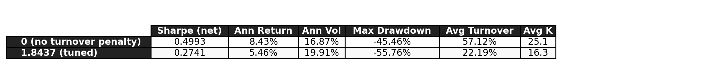

# GA Portfolio Optimization


BSc CS thesis project at VU Amsterdam. A genetic algorithm selects cardinality-constrained US equity portfolios and is evaluated out-of-sample against MVO and equal-weight benchmarks from January 2005 to December 2025 (252 monthly periods) on a universe of around 870 stocks. The GA underperforms all three benchmarks, with a Sharpe of 0.274 vs 0.581 for MVO.

An interactive step-by-step walkthrough of the algorithm is live at [ga-visualizer.netlify.app](https://ga-visualizer.netlify.app/). It follows one generation end to end on a 12-slot demo chromosome, with the same operators as the real pipeline. The full thesis and defense slides are available in [`docs/thesis.pdf`](docs/thesis.pdf), [`docs/presentation.pdf`](docs/presentation.pdf), and [`docs/presentation.pptx`](docs/presentation.pptx).

## Results

| Strategy | Sharpe (net) | Ann. Return | Ann. Vol | Max Drawdown | Avg Turnover |
|---|---|---|---|---|---|
| **GA (adaptive K)** | **0.2741** | **5.5%** | **19.9%** | **-55.8%** | **22.2%** |
| Constrained MVO | 0.5810 | 8.3% | 14.3% | -43.1% | 17.1% |
| Unconstrained MVO | 0.5809 | 8.3% | 14.3% | -43.1% | 17.1% |
| 1/N (867 stocks) | 0.5307 | 9.1% | 17.2% | -51.3% | 4.5% |

Evaluation: January 2005 to December 2025, 252 monthly out-of-sample periods. All metrics are on net excess returns after transaction costs. Annualized return = mean monthly * 12, annualized vol = monthly std * sqrt(12), Sharpe = annualized return / annualized vol. Constrained MVO caps individual weights at 0.15.

The GA underperforms all three benchmarks. The Jobson-Korkie test shows the GA vs MVO Sharpe gap is statistically significant (p = 0.004); the GA vs 1/N gap is not (p = 0.132). Constrained and unconstrained MVO produce nearly identical results (0.5810 vs 0.5809): with around 62 active stocks on average, the implied mean weight of 1.6% stays well below the 15% cap.

The primary cause of underperformance is the turnover penalty. A full 252-period ablation (λ = 0 vs λ = 1.8437) shows that removing the penalty raises net Sharpe from 0.274 to 0.499, recovering roughly three-quarters of the gap against MVO. The remaining shortfall reflects estimation noise from a rank-deficient covariance matrix (N/T ≈ 14.5). The fixed-K sweep corroborates this: K = 25 and K = 30 reach Sharpe 0.44, while the adaptive mechanism settles near K = 16.3 on average, because the penalty makes smaller portfolios cheaper to hold.


*Cumulative net portfolio value, 2005–2025.*

<details>
<summary>Rolling 12-month Sharpe ratio</summary>


GA underperforms MVO across most of the evaluation period.

</details>

<details>
<summary>Adaptive cardinality K over time</summary>


The GA settles near K = 16 on average, well below the upper bound of 30.

</details>

<details>
<summary>Significance tests</summary>


Jobson-Korkie test (Memmel 2003 correction). GA vs MVO p = 0.004; GA vs 1/N p = 0.132.

</details>

<details>
<summary>Turnover penalty ablation</summary>



Removing the penalty raises net Sharpe from 0.274 to 0.499, recovering roughly three-quarters of the gap against MVO.

</details>

## Methodology

- **Data:** CRSP monthly stock file (CIZ format), Jan 2000–Dec 2025 (WRDS). Risk-free rate: FRED DTB3 (3-month T-bill, annual % converted to monthly decimal).
- **Universe:** NYSE/NASDAQ common stocks, market cap >= $2B (lagged 1 month). Around 870 eligible stocks per month. 60-month burn-in, first rebalancing January 2005. Covariance estimated with Ledoit-Wolf shrinkage (sklearn).
- **GA:** Real-valued weight vector, K in [10, 30] non-zero entries each in [0.02, 0.15] summing to 1. Fitness = monthly Sharpe - lambda * Turnover (lambda = 1.8437). Tournament selection, union-based crossover with arithmetic blend (two children per parent pair), Gaussian and asset-swap mutation, two-stage repair: cardinality enforcement, then bisection projection onto the bounded simplex. 8 independent runs per period. Population 100, max 200 generations, 20-generation early stop.
- **MVO:** Long-only Sharpe maximisation via SLSQP (3 random restarts). Constrained variant caps individual weights at 0.15. Same estimation window, universe, and cost model as the GA.
- **Evaluation:** 252 monthly OOS periods, rolling 60-month window. Transaction cost gamma = 0.3% per unit of turnover, deducted from all strategies. Significance: paired t-test and Jobson-Korkie test (Memmel 2003 correction).
- **Tuning:** Optuna TPE sampler, 15 trials on 2005–2012 (96 periods). Tuned parameters (pc=0.6054, pm=0.1370, sigma_m=0.1469, lambda=1.8437) fixed for the full 2005–2025 evaluation.

## Repository Structure

The repository is organized around the research pipeline, generated outputs, thesis documents, tests, automation, and the interactive visualizer.

<details>
<summary><strong>Click to expand repository structure</strong></summary>

```text
.
├── .github/
│   └── workflows/
│       └── tests.yml                         GitHub Actions test workflow
├── docs/
│   ├── presentation.pdf                      defense slides, PDF
│   ├── presentation.pptx                     defense slides, PowerPoint
│   └── thesis.pdf                            full BSc thesis writeup
├── results/
│   ├── ablation/                             lambda-ablation outputs
│   │   ├── lambda_ablation_summary.csv
│   │   └── lambda_ablation_table.png
│   ├── figures/                              main paper figures and convergence plots
│   │   ├── A1_convergence.png
│   │   ├── A1_convergence_comparison.png
│   │   ├── A1_convergence_default.png
│   │   ├── A1_convergence_tuned.png
│   │   ├── F1_cumulative_returns.png
│   │   ├── F2_rolling_sharpe.png
│   │   ├── F3_turnover.png
│   │   ├── F4_hhi.png
│   │   ├── F5_cardinality.png
│   │   └── F6_frontier.png
│   ├── k_sensitivity/                        fixed-K figures and tables
│   │   ├── FK1_sharpe_turnover_hhi_vs_k.png
│   │   ├── FK2_cumulative_returns_by_k.png
│   │   ├── table_k_sensitivity.csv
│   │   ├── table_k_sensitivity.png
│   │   ├── table_k_sensitivity.tex
│   │   └── table_k_sensitivity_formatted.csv
│   ├── optuna/                               tuned GA parameter file
│   │   └── best_params.json
│   ├── post_processing/                      subperiod, transaction-cost, and K-behavior outputs
│   │   ├── k_behavior.csv
│   │   ├── k_behavior.png
│   │   ├── subperiod_robustness.csv
│   │   ├── subperiod_robustness.png
│   │   ├── tc_sensitivity.csv
│   │   └── tc_sensitivity.png
│   └── tables/                               performance, significance, characteristics, robustness tables
│       ├── T1_performance.csv
│       ├── T1_performance.png
│       ├── T1_performance.tex
│       ├── T2_significance.csv
│       ├── T2_significance.png
│       ├── T2_significance.tex
│       ├── T3_characteristics.csv
│       ├── T3_characteristics.png
│       ├── T3_characteristics.tex
│       ├── T4_k_sensitivity.csv
│       ├── T4_k_sensitivity.png
│       ├── T5_lambda_ablation.png
│       ├── T6_subperiod_robustness.png
│       ├── T7_tc_sensitivity.png
│       ├── T8_k_behavior.csv
│       └── T8_k_behavior.png
├── src/
│   ├── __init__.py
│   ├── ablation/                             lambda=0 turnover-penalty ablation
│   │   ├── __init__.py
│   │   └── ablation_lambda.py
│   ├── benchmarks/                           constrained MVO, unconstrained MVO, equal weight
│   │   ├── __init__.py
│   │   ├── equal_weight.py
│   │   └── mvo.py
│   ├── data/                                 CRSP/FRED loading, universe filters, return matrices
│   │   ├── __init__.py
│   │   ├── loader.py
│   │   ├── returns.py
│   │   ├── risk_free_rate.py
│   │   └── universe.py
│   ├── evaluation/                           metrics, figures, tables, significance tests
│   │   ├── __init__.py
│   │   ├── convergence.py
│   │   ├── figures.py
│   │   ├── frontier.py
│   │   ├── k_sensitivity_figures.py
│   │   ├── k_sensitivity_tables.py
│   │   ├── metrics.py
│   │   ├── post_processing.py
│   │   ├── significance.py
│   │   └── tables.py
│   ├── optimization/                         GA implementation, full runner, Optuna tuning, fixed-K runs
│   │   ├── __init__.py
│   │   ├── genetic_algorithm.py
│   │   ├── k_sensitivity.py
│   │   ├── optuna_tuner.py
│   │   └── runner.py
│   └── utils/                                shared portfolio and data helpers
│       ├── __init__.py
│       ├── data.py
│       └── portfolio.py
├── tests/                                    synthetic integrity tests
│   ├── test_backtest_integrity.py
│   ├── test_genetic_algorithm.py
│   └── test_metrics.py
├── visualizer/                               Vite/React interactive GA walkthrough
│   ├── index.html
│   ├── package-lock.json
│   ├── package.json
│   ├── public/
│   │   ├── favicon.svg
│   │   └── fonts/                            self hosted Montserrat and Blinker
│   ├── src/
│   │   ├── App.jsx
│   │   ├── index.css
│   │   └── main.jsx
│   └── vite.config.js
├── data/                                     expected local data folder, not committed
│   ├── raw/                                  local WRDS/FRED inputs, untracked
│   └── processed/                            generated intermediate data, untracked
├── .gitignore
├── LICENSE
├── README.md
├── REPRODUCIBILITY.md
├── requirements.txt
└── run_evaluation.sh
```

</details>

## Setup

Python 3.11+ is required for the research pipeline.

```bash
python3 -m venv .venv
source .venv/bin/activate
pip install -r requirements.txt
python3 -m pytest
```

Key Python dependencies: `pandas`, `numpy`, `scipy`, `scikit-learn`, `pyarrow`, `statsmodels`, `optuna`, `matplotlib`, `seaborn`, `tqdm`.

<details>
<summary><strong>Visualizer setup</strong></summary>

The visualizer is a separate Vite/React app under `visualizer/`. It is laid out as fixed 16:9 slides to match the defense deck. Navigation works with the arrow keys, number keys 1 to 8, space, or a presenter clicker.

```bash
cd visualizer
npm install
npm run dev
```

For a production build:

```bash
cd visualizer
npm run build
```

</details>

## Reproduction

Run each step in order from the repository root. Raw CRSP data requires a WRDS subscription and is not committed.

Place these files in `data/raw/`:

- `crsp_returns.csv`: CRSP monthly stock file, CIZ format, 2000-2025. WRDS path: CRSP Annual Update -> Stock Version 2 (CIZ) -> Monthly Stock File. Required columns: `MthCalDt`, `MthRet`, `MthRetx`, `MthPrc`, `PrimaryExch`, `ShareType`, `SecurityType`, `SecuritySubType`, `USIncFlg`, `IssuerType`, `ShrOut`.
- `risk_free_rate.csv`: FRED DTB3 series, 3-month T-bill annual percent, saved as downloaded from FRED.

<details>
<summary><strong>1. Data loading</strong></summary>

```bash
python3 -m src.data.loader
python3 -m src.data.risk_free_rate
```

</details>

<details>
<summary><strong>2. Universe construction</strong></summary>

```bash
python3 -m src.data.universe
python3 -m src.data.returns
```

</details>

<details>
<summary><strong>3. MVO benchmarks</strong></summary>

```bash
python3 -m src.benchmarks.mvo
```

</details>

<details>
<summary><strong>4. Equal-weight benchmark</strong></summary>

```bash
python3 -m src.benchmarks.equal_weight
```

</details>

<details>
<summary><strong>5. Optuna tuning (optional)</strong></summary>

Tuned parameters are already in `genetic_algorithm.py`.

```bash
python3 -m src.optimization.optuna_tuner
```

</details>

<details>
<summary><strong>6. Full GA run</strong></summary>

35-45 minutes on c2-standard-16, 8 physical cores.

```bash
python3 -m src.optimization.runner
```

Resume from checkpoint by running the same command again. Use `--debug` for a fast 10-period smoke test with 3 runs and 50 generations:

```bash
python3 -m src.optimization.runner --debug
```

</details>

<details>
<summary><strong>6b. K-sensitivity (optional)</strong></summary>

Runs each fixed K value independently.

```bash
python3 -m src.optimization.k_sensitivity
```

Or a single K value:

```bash
python3 -m src.optimization.k_sensitivity --k 25
```

</details>

<details>
<summary><strong>7. Lambda ablation</strong></summary>

About 30 minutes for the lambda=0 GA run.

```bash
python3 -m src.ablation.ablation_lambda
```

This runs the full 252-period GA with lambda=0, then compares with the main results parquet.

</details>

<details>
<summary><strong>8. Evaluation figures and tables</strong></summary>

```bash
./run_evaluation.sh
```

This runs the lambda ablation followed by all evaluation scripts in order. Individual scripts can also be run directly:

```bash
python3 -m src.evaluation.tables
python3 -m src.evaluation.significance
python3 -m src.evaluation.figures
python3 -m src.evaluation.post_processing
python3 -m src.evaluation.k_sensitivity_tables
python3 -m src.evaluation.k_sensitivity_figures
python3 -m src.evaluation.convergence
python3 -m src.evaluation.frontier
```

</details>

## Limitations and reproducibility

Raw CRSP data requires a WRDS subscription and is not included. `REPRODUCIBILITY.md` gives the exact reproduction order from raw data to final figures. Integrity tests in `tests/` use synthetic data only and can be run without WRDS access.

## License

MIT © [Georgios Dedempilis](https://github.com/georgeded)
